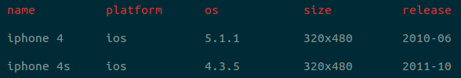

# viewport-list-cli [](https://travis-ci.org/kevva/viewport-list-cli)

> Return a list of devices and their viewports

```bash
$ viewport-list iphone4 --pretty
```



## Install

```
$ npm install --global viewport-list-cli
```


## Usage

```bash
$ viewport-list --help

  Usage
    $ viewport-list [device] [--pretty]
    $ viewport-list < <file>

  Example
    $ viewport-list iphone4 iphone5
    $ viewport-list < devices.txt
    $ viewport-list iphone4 --pretty
    $ viewport-list iphone4 -p
    $ viewport-list -p < devices.txt
```


## License

MIT © [Kevin Mårtensson](https://github.com/kevva)
